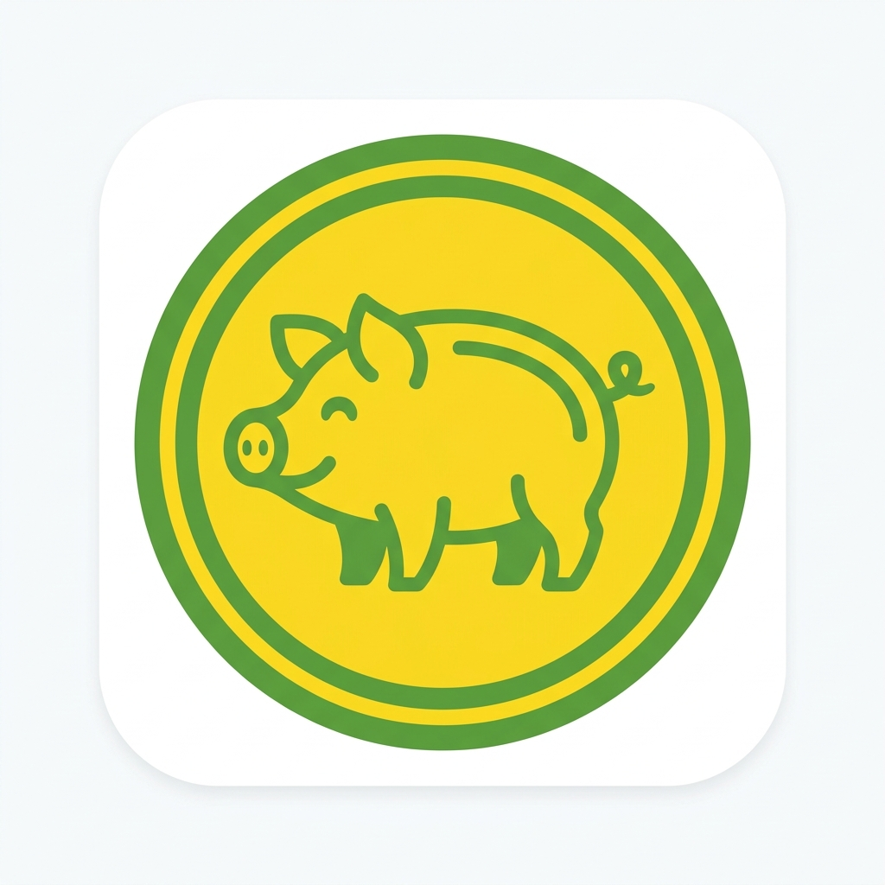

# 🐖 CasaganPigery v2 - Premium Farm Management System



CasaganPigery v2 is a high-end, modern Farm Management and Marketplace system designed specifically for piggery operations. Built with **Laravel 12** and **React (Vite)**, it combines robust backend tracking with a stunning "Nature-Glassmorphism" aesthetic. Includes the new Weaning Management Feature.

## 🌟 Key Features

### 🚜 Farm Operations (Admin Console)

- **Dashboard Analytics**: Real-time statistics on pig population, active breeding, and sales performance.
- **Inventory Management**: Detailed tracking for _Inahin_ (Sows), _Platining_ (Growers), and _Biik_ (Piglets).
- **Breeding Records**: Automatic gestation cycle calculation (114 days) with farrowing reminders.
- **Health & Nutrition**: Digital logbook for vaccinations, medications, and feed stock monitoring.
- **Sales & Customers**: Manage buyer databases and transaction history with ease.

### 🏪 Digital Marketplace

- **Public Inquiry System**: High-conversion landing page allowing visitors to browse for-sale livestock.
- **Facebook Messenger Integration**:
    - One-click inquiry system using professional message templates.
    - Facebook Login verification for buyer authenticity.
    - Automated redirects to Messenger with pre-filled pig details.
- **Privacy & Compliance**: Built-in Privacy Policy and Data Deletion instructions for Facebook App verification.

## 🎨 Design System

The project uses a custom-curated palette inspired by sustainable farming:

- **Leaf Green** (`#2D4F1E`): Primary branding and growth.
- **Rattan Gold** (`#D4A373`): Secondary accents and warmth.
- **Straw White** (`#F1EAD9`): Backgrounds and soft transitions.
- **Earth Brown** (`#4A3728`): Professional typography.

## 🛠️ Technology Stack

- **Backend**: Laravel 12 (PHP 8.2+)
- **Frontend**: React 18, Vite, TypeScript
- **Styling**: Vanilla CSS with Tailwind-inspired utility tokens
- **Icons**: Lucide React
- **Database**: MySQL / MariaDB
- **Auth**: Laravel Breeze (Inertia.js)

## 🚀 Installation & Setup

1. **Clone the repository**:

    ```bash
    git clone https://github.com/your-repo/casagan-pigery.git
    cd casagan-pigery
    ```

2. **Install Dependencies**:

    ```bash
    composer install
    npm install
    ```

3. **Environment Setup**:
    - Copy `.env.example` to `.env`
    - Set your database credentials
    - Configure `VITE_FB_APP_ID` for Facebook integration

4. **Run Migrations & Seeds**:

    ```bash
    php artisan migrate
    ```

5. **Build Assets**:

    ```bash
    npm run build
    ```

6. **Serve**:
    ```bash
    php artisan serve
    ```

## 🔒 Facebook App Configuration

For the Messenger inquiry system to work:

- Set **App Domains** to your production URL.
- Set **Privacy Policy URL** to `https://casaganpigery.ct.ws/privacy`.
- Enable **Facebook Login** and **JavaScript SDK**.

## 📄 License

This project is proprietary and custom-built for **CasaganPigery**. All rights reserved.

---

_Built with ❤️ for CasaganPigery Farm - Since 2010_
